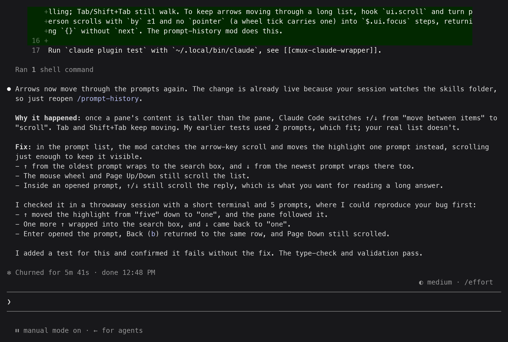

# claude-session-explorer

A Claude Code plugin marketplace, `session-explorer`, with one mod so far: **prompt-history**.

## prompt-history

`/prompt-history` opens a side pane listing every prompt you sent in the current session. For each one you can read the final reply and the tool calls it made, put the prompt back in the prompt box to edit and resend it, or rewind the conversation to it.



- The list shows each prompt's first few lines, the start of the final reply, and how many tools it ran and files it edited.
- Search filters by prompt text as you type.
- Opening a prompt shows its full text, the whole reply rendered as Markdown, and a collapsible list of its tool calls.
- Colors come from the Claude Code theme, so the pane looks right in light, dark, colorblind-friendly and ANSI themes.

### Install

```sh
claude plugin marketplace add felipeam86/claude-session-explorer
claude plugin install prompt-history@session-explorer
```

From a local clone, pass its path instead: `claude plugin marketplace add /path/to/claude-session-explorer`.

Then run `/reload-plugins` in an open session, or start a new one.

To remove it: `claude plugin uninstall prompt-history@session-explorer`.

### Keys

In the list:

| Key | Action |
| --- | --- |
| ↑ / ↓, Tab / Shift+Tab | Move between prompts. ↑ from the oldest or ↓ from the newest goes to the search box |
| Enter | Open the highlighted prompt |
| Mouse wheel, Page Up / Down | Scroll the list |
| Esc | Close the pane |

In the search box, type to filter the list. Enter jumps to the newest match and keeps the filter; Enter on an empty box clears it.

In an opened prompt:

| Key | Action |
| --- | --- |
| `b` | Back to the list, on the same prompt |
| `p` / `n` | Previous / next prompt |
| `j` | Jump to the start of the reply |
| `t` | Show or hide the tool calls |
| `e` | Put the prompt in the prompt box to edit and resend it (replaces any draft) |
| `r` | Rewind: opens Claude Code's `/rewind` picker and shows which prompt number to choose |
| ↑ / ↓ | Scroll a long reply |

### Limitations

- Rewind can't jump straight to a prompt: it opens the built-in picker, and you choose the prompt it names.
- Only text you typed counts as a prompt. Slash commands, `!` shell commands and background-task notices are left out, so the reply to a skill command (for example `/review`) is attached to the prompt before it.
- After the conversation is compacted, only prompts since the compaction are listed.
- Replies longer than 10,000 characters are cut off in the opened view.

### Requirements

Claude Code with function-hook mods. Tested on 2.1.289 and 2.1.290. The mod API is in early access and may change between releases.

## Development

The mod's source is in `plugins/prompt-history/`. Claude Code writes the API type declarations to `.claude-plugin/types/` inside the plugin folder the first time it loads it; they are generated, so git ignores them.

```sh
claude plugin validate --strict .                  # marketplace manifest
claude plugin validate --strict plugins/prompt-history
claude plugin test plugins/prompt-history          # unit and UI tests
npx -p typescript tsc -p plugins/prompt-history    # type-check, once the types exist
```

An installed copy reads from this folder, so after an edit `/reload-plugins` picks it up without reinstalling. Bump `version` in both `plugins/prompt-history/.claude-plugin/plugin.json` and `.claude-plugin/marketplace.json` for a release.
